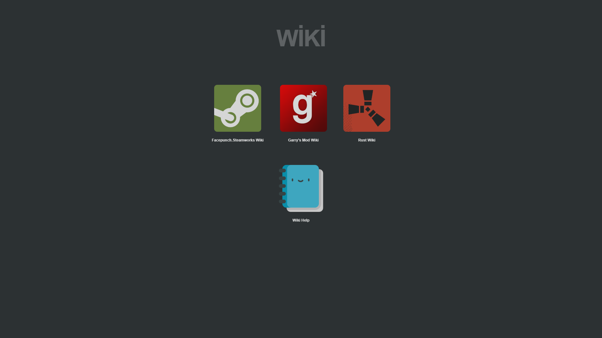
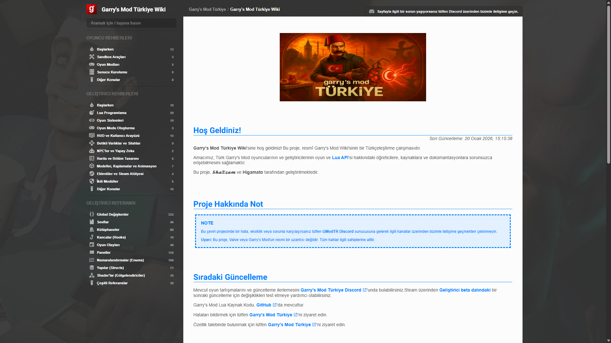
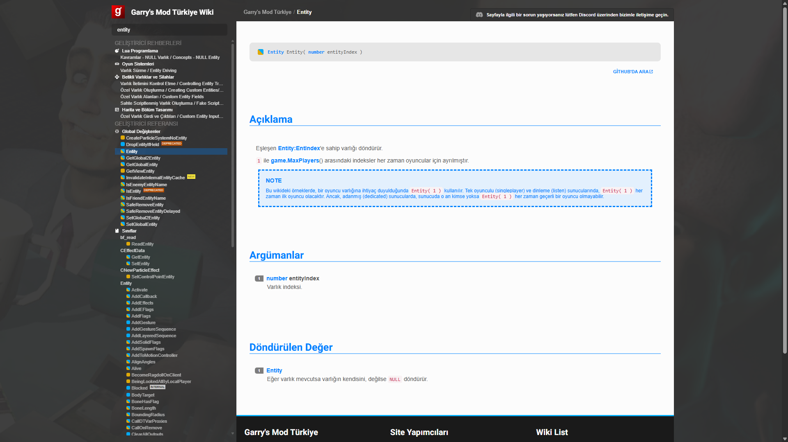
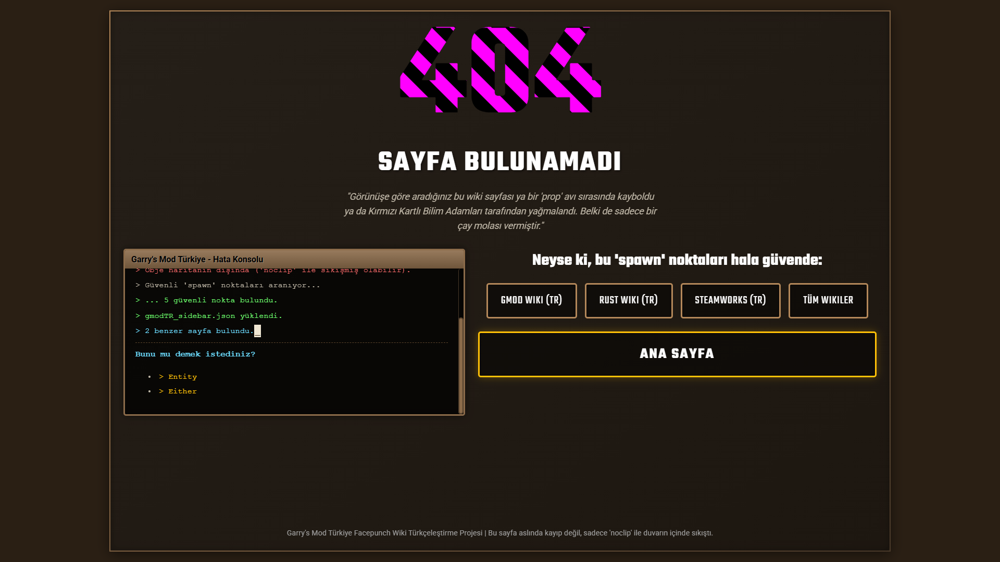
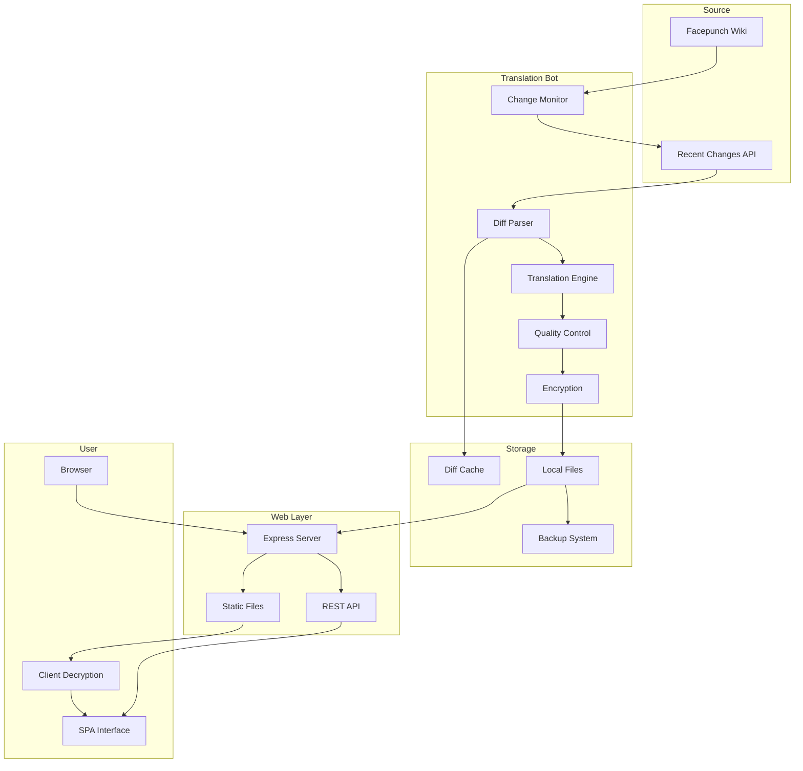
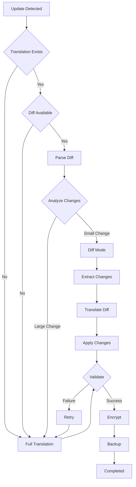

# **🎮 Facepunch Wiki Turkish Translation Project**

>A Turkish wiki resource for Facepunch games. 
>This repository contains documentation only. 
>Source code of the website is not publicly available.

**🌐 Live site:** [wiki.gmodtr.com](https://wiki.gmodtr.com/)

**🇹🇷 Türkçe sürüm:** [README.tr.md](README.tr.md)

## **📋 Table of Contents**

* [About the Project](#-about-the-project)
* [Features](#-features)
* [Technologies](#technologies)
* [Screenshots](#-screenshots)
* [Architecture](#architecture)
* [Performance](#-performance-metrics)
* [How to Contribute](#ways-to-contribute)

## **🎯 About the Project**

This project is a system that automatically translates and keeps up-to-date the English wiki pages on [wiki.facepunch.com](https://wiki.facepunch.com) into Turkish. The goal is to provide native-language technical documentation to the Turkish gaming community.

### **Supported Wikis**

* ✅ **Garry's Mod** (GLua API \- 6000+ pages)  
* ✅ **Rust** (game mechanics and API)  
* ✅ **Steamworks** (Steam integration APIs)  
* ✅ **Facepunch General Wiki**

## **✨ Features**

### **🤖 Intelligent Translation System**

* **Diff-Based Updates**: Translates only the changed parts instead of the whole page  
  * Saves 50–90% on token usage  
  * Faster update cycles  
  * Cost optimization  
* **Triple-Layer Hybrid AI Model**:  
  * **Primary:** Google Gemini AI (High context awareness)  
  * **Secondary:** DeepL API (High linguistic accuracy)  
  * **Final Fallback:** Helsinki-NLP opus-mt-tc-big-en-tr (Offline)
  * *Automatic failover ensures 100% availability even if APIs are down.*  
* **Technical Content Protection**:  
  * Code blocks are preserved unchanged  
  * Function names are not translated  
  * API parameters remain in their original form  
  * HTML structure is kept intact

### **🔄 Automatic Updating**

* Hourly check system  
* Detects changes on the source wiki  
* Processes only updated pages  
* Resumes from where it left off in case of errors

### **🔍 Advanced Search**

* Full-text search  
* Real-time results  
* Highlighted result display  
* Category-based filtering

### **💾 Data Security**

* All content is stored encrypted  
* Automatic backup system  
* Version control  
* Cloud backup support

## **Technologies**

### **Backend**

* **Python 3.8+** \- Main bot logic and translation engine  
* **Node.js/Express** \- Web server and API

### **AI & Translation**

* **Google Gemini AI** \- Primary translation engine  
* **DeepL API** \- Secondary fallback translation service  
* **facebook/nllb-200-distilled-600M** \- Local offline translation model  
* **Custom Validation** \- Translation quality control system

### **Frontend**

* **Vanilla JavaScript** \- Single Page Application (SPA)  
* **Modern CSS** \- Responsive design  
* **Client-Side Encryption** \- Secure content delivery

## 📸 Screenshots

  
  
  
  

## **Architecture**

### **System Flowchart**

### **Translation Workflow**

## **📊 Performance Metrics**

| Metric | Value |
| :---- | :---- |
| **Total Pages** | 8000+ |
| **Average Translation Time** | 15–30 seconds/page |
| **Diff Mode Savings** | 50–90% tokens |
| **Daily Updates** | 10–50 pages |
| **System Reliability** | 99.9% (w/ Local Fallback) |
| **Cache Hit Rate** | \~75% |
| **Page Load** | \< 500ms |

## **🎯 Technical Challenges and Solutions**

### **1\. Large-Scale Content Management**

**Challenge**: 8000+ pages and continuously updating content

**Solution**:

* Diff-based update system  
* Priority processing queue  
* Uninterrupted operation via progress tracking

### **2\. Translation Quality**

**Challenge**: Correct translation of technical terms

**Solution**:

* Custom prompt engineering  
* Code block detection and protection  
* Automated validation system

### **3\. Cost Optimization & Reliability**

**Challenge**: Keeping API costs low and ensuring uptime

**Solution**:

* Diff mode saves up to 90%  
* Multi-tier failover strategy (Gemini \-\> DeepL \-\> Local)  
* Local model ensures operation during network outages

### **4\. Security**

**Challenge**: Content security and DDoS protection

**Solution**:

* Client-side decryption  
* Rate limiting  
* Static file hosting

## **🤝 Community**

This project is developed for the Turkish gaming community and with community contributions.

### **Contact**

* 🌐 **Web**: [wiki.gmodtr.com](https://wiki.gmodtr.com/)  
* 💬 **Feedback**: Via the site contact form

### **Ways to Contribute**

* 🐛 Report bugs  
* 💡 Suggest features  
* 📝 Improve translations  
* ⭐ Star the project

## **📈 Statistics**

📚 Total Translated Content: 8000+ pages  
🔄 Daily Updates: 10–50 pages  
👥 Active Users: \[Hidden\]  
🌍 Total Visits: \[Hidden\]  
⚡ Uptime: 99.9%+

## **🏆 Achievements**

* ✅ Turkey's first Facepunch wiki translation project  
* ✅ Continuous freshness through automatic updates  
* ✅ High translation quality (Hybrid AI \+ Validation)  
* ✅ Fast and secure access

## **📄 Legal Notice**

This project is a Turkish translation of [wiki.facepunch.com](https://wiki.facepunch.com). All original content rights belong to Facepunch Studios. This project is a non-commercial, community project for educational purposes.

**[🌐 Visit the Wiki](https://wiki.gmodtr.com)**

Made with ❤️ for the Turkish gamer community

