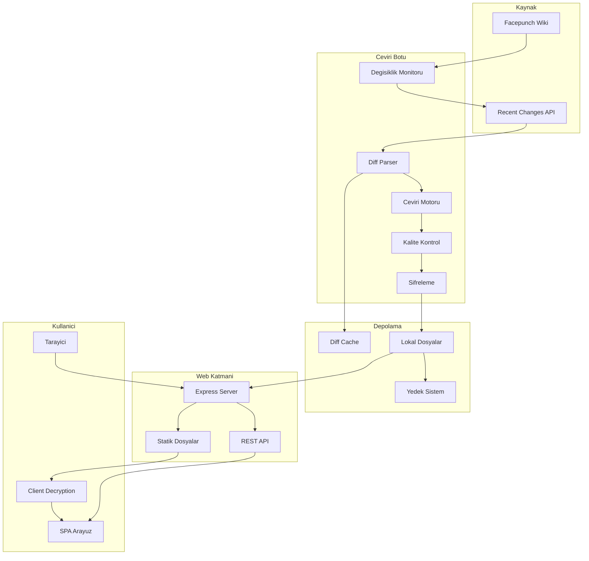
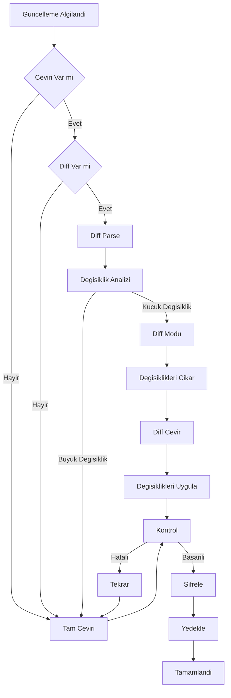

# **🎮 Facepunch Wiki Türkçe Çeviri Projesi**

>Facepunch oyunları için Türkçe wiki kaynağı. 
>Bu depo yalnızca dokümantasyon içermektedir. 
>Web sitesinin kaynak kodu herkese açık değildir.

**🌐 Canlı Site:** [wiki.gmodtr.com](https://wiki.gmodtr.com/)

**🇬🇧 English version:** [README.md](README.md)

## **📋 İçindekiler**

- [Proje Hakkında](#-proje-hakkında)
- [Özellikler](#-özellikler)
- [Teknolojiler](#teknolojiler)
- [Ekran Görüntüleri](#-ekran-görüntüleri)
- [Mimari](#mimari)
- [Performans](#-performans-metrikleri)
- [Katkıda Bulunma](#katkıda-bulunma-yolları)

## **🎯 Proje Hakkında**

Bu proje, [wiki.facepunch.com](https://wiki.facepunch.com) sitesindeki İngilizce wiki sayfalarını otomatik olarak Türkçe'ye çeviren ve güncel tutan bir sistemdir. Amaç, Türk oyuncu topluluğuna anadilde teknik dokümantasyon sunmaktır.

### **Desteklenen Wikiler**

* ✅ **Garry's Mod** (GLua API \- 6000+ sayfa)  
* ✅ **Rust** (Oyun mekaniği ve API)  
* ✅ **Steamworks** (Steam entegrasyon API'ları)  
* ✅ **Facepunch Genel Wiki**

## **✨ Özellikler**

### **🤖 Akıllı Çeviri Sistemi**

* **Diff-Tabanlı Güncelleme**: Tam sayfa yerine sadece değişen kısımları çevirir  
  * Token kullanımında %50-90 tasarruf  
  * Daha hızlı güncelleme döngüsü  
  * Maliyet optimizasyonu  
* **Üç Katmanlı Hibrit YZ Modeli**:  
  * **Birincil:** Google Gemini AI (Yüksek bağlam farkındalığı)  
  * **İkincil:** DeepL API (Yüksek dilbilimsel doğruluk)  
  * **Son Çare:** Helsinki-NLP opus-mt-tc-big-en-tr (Çevrimdışı çalışabilirlik)  
  * *Otomatik geçiş sistemi, API'ler çökse bile %100 erişilebilirlik sağlar.*  
* **Teknik İçerik Koruması**:  
  * Kod blokları değişmeden korunur  
  * Fonksiyon isimleri çevrilmez  
  * API parametreleri orijinal kalır  
  * HTML yapısı bozulmaz

### **🔄 Otomatik Güncelleme**

* Saatlik kontrol sistemi  
* Kaynak wiki'deki değişiklikleri algılar  
* Sadece güncellenmiş sayfaları işler  
* Hata durumunda kaldığı yerden devam eder

### **🔍 Gelişmiş Arama**

* Tam metin araması  
* Gerçek zamanlı sonuçlar  
* Vurgulama ile sonuç gösterimi  
* Kategori bazlı filtreleme

### **💾 Veri Güvenliği**

* Tüm içerikler şifreli saklanır  
* Otomatik yedekleme sistemi  
* Versiyon kontrolü  
* Cloud backup desteği

## **Teknolojiler**

### **Backend**

* **Python 3.8+** \- Ana bot mantığı ve çeviri motoru  
* **Node.js/Express** \- Web sunucusu ve API

### **AI & Çeviri**

* **Google Gemini AI** \- Birincil çeviri motoru  
* **DeepL API** \- İkincil yedek çeviri servisi  
* **Helsinki-NLP/opus-mt-tc-big-en-tr** \- Yerel çevrimdışı çeviri modeli  
* **Custom Validation** \- Çeviri kalite kontrol sistemi

### **Frontend**

* **Vanilla JavaScript** \- SPA (Single Page Application)  
* **Modern CSS** \- Responsive tasarım  
* **Client-Side Encryption** \- Güvenli içerik dağıtımı

## **📸 Ekran Görüntüleri**

  
  
  
  

## **Mimari**

### **Sistem Akış Şeması**

### **Çeviri İş Akışı**

## **📊 Performans Metrikleri**

| Metrik | Değer |
| :---- | :---- |
| **Toplam Sayfa** | 8000+ |
| **Ortalama Çeviri Süresi** | 15-30 saniye/sayfa |
| **Diff Modu Tasarrufu** | %50-90 token |
| **Günlük Güncelleme** | 10-50 sayfa |
| **Sistem Güvenilirliği** | %99.9 (Yerel Yedekleme ile) |
| **Cache Hit Oranı** | \~%75 |
| **Sayfa Yükleme** | \< 500ms |

## **🎯 Teknik Zorluklar ve Çözümler**

### **1\. Büyük Ölçekli İçerik Yönetimi**

**Zorluk**: 8000+ sayfa ve sürekli güncellenen içerik

**Çözüm**:

* Diff-tabanlı güncelleme sistemi  
* Öncelikli işleme kuyruğu  
* Progress tracking ile kesintisiz çalışma

### **2\. Çeviri Kalitesi**

**Zorluk**: Teknik terimlerin doğru çevrilmesi

**Çözüm**:

* Özel prompt engineering  
* Kod bloğu tanıma ve koruma  
* Otomatik validasyon sistemi

### **3\. Maliyet Optimizasyonu & Güvenilirlik**

**Zorluk**: API maliyetlerini düşük tutma ve süreklilik

**Çözüm**:

* Diff modu ile %90'a varan tasarruf  
* Çok katmanlı yedekleme stratejisi (Gemini \-\> DeepL \-\> Yerel)  
* Yerel model, ağ kesintilerinde çalışmayı garanti eder

### **4\. Güvenlik**

**Zorluk**: İçerik güvenliği ve DDoS koruması

**Çözüm**:

* Client-side decryption  
* Rate limiting  
* Statik dosya hosting

## **🤝 Topluluk**

Bu proje, Türk oyuncu topluluğu için ve topluluk katkılarıyla geliştirilmektedir.

### **İletişim**

* 🌐 **Web**: [wiki.gmodtr.com](https://wiki.gmodtr.com/)  
* 💬 **Geri Bildirim**: Site üzerinden iletişim formu

### **Katkıda Bulunma Yolları**

* 🐛 Hata bildirimi  
* 💡 Özellik önerisi  
* 📝 Çeviri düzeltmeleri  
* ⭐ Projeyi yıldızlama

## **📈 İstatistikler**

📚 Toplam Çevrilen İçerik: 8000+ sayfa  
🔄 Günlük Güncelleme: 10-50 sayfa  
👥 Aktif Kullanıcı: \[Gizli\]  
🌍 Toplam Ziyaret: \[Gizli\]  
⚡ Uptime: %99.9+

## **🏆 Başarılar**

* ✅ Türkiye'nin ilk Facepunch wiki çeviri projesi  
* ✅ Otomatik güncelleme ile sürekli güncellik  
* ✅ Yüksek çeviri kalitesi (Hibrit AI \+ Validation)  
* ✅ Hızlı ve güvenli erişim

## **📄 Hukuki Uyarı**

Bu proje, [wiki.facepunch.com](https://wiki.facepunch.com) sitesinin Türkçe çevirisidir. Tüm orijinal içerik hakları Facepunch Studios'a aittir. Bu proje ticari olmayan, eğitim amaçlı bir topluluk projesidir.

**[🌐 Wiki'yi Ziyaret Et](https://wiki.gmodtr.com)**

Türk Oyuncu Topluluğu için ❤️ ile yapıldı

